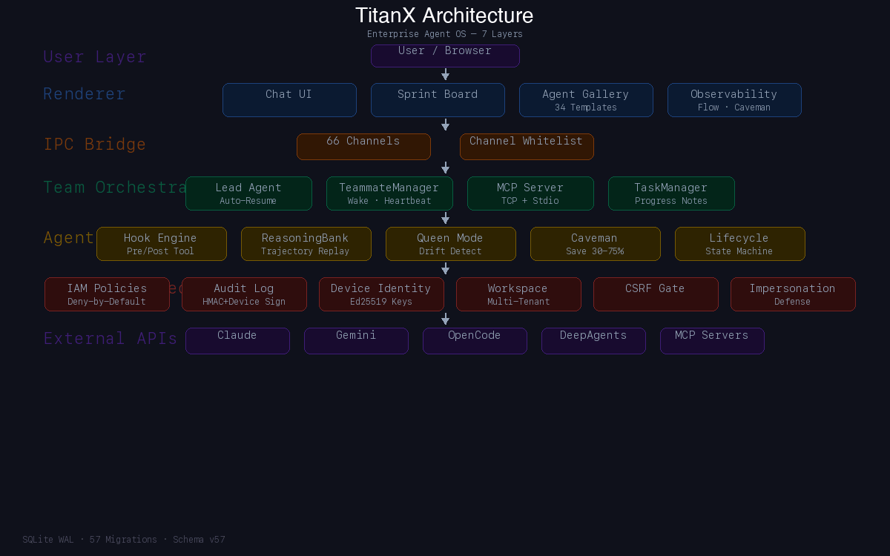
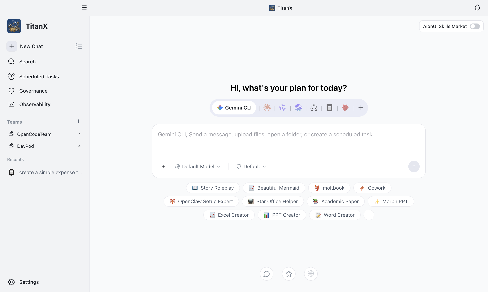
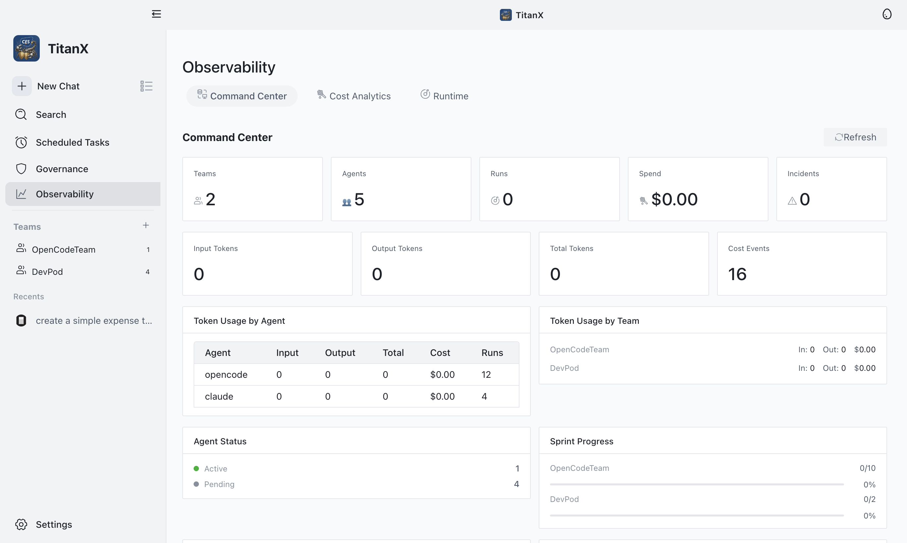
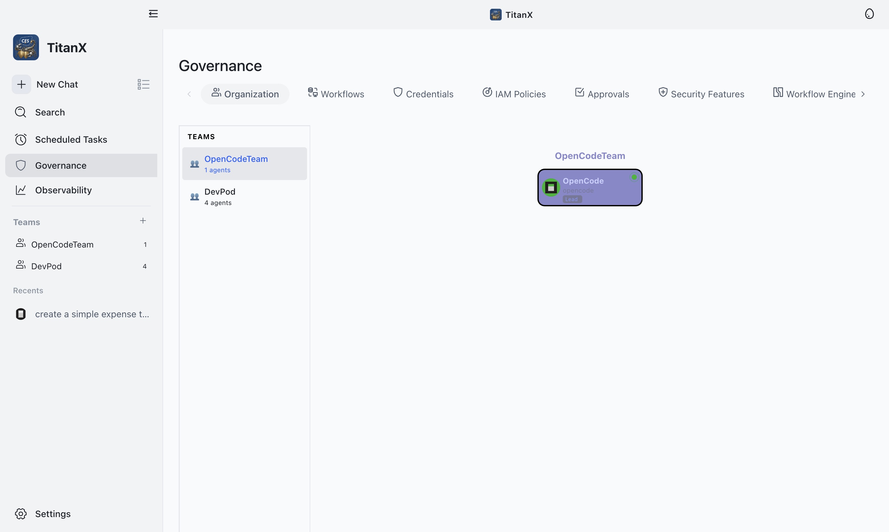
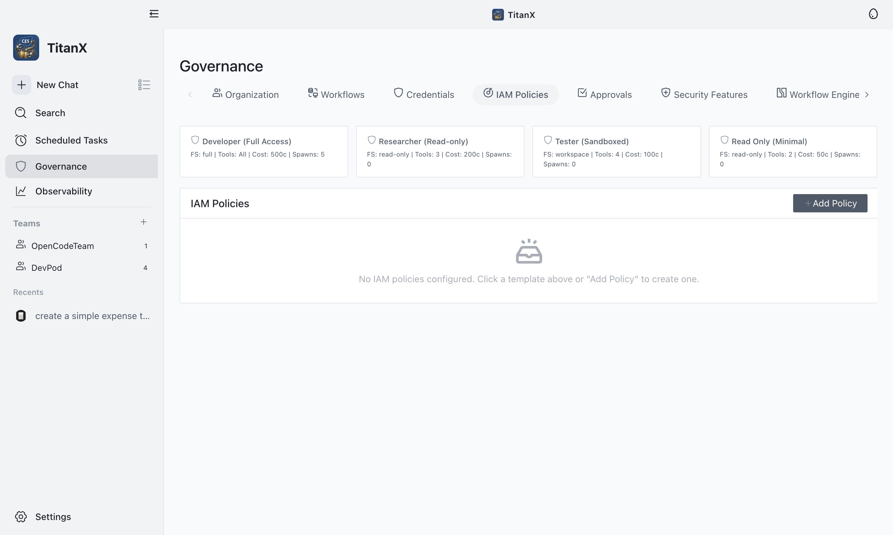

<p align="center">
  
</p>

<h1 align="center">TitanX</h1>

<p align="center">
  <strong>Enterprise AI Agent Orchestration Platform — Secure, Observable, Configurable ⚡</strong>
</p>

<p align="center">
  <em>Your AI Digital Workforce with enterprise-grade security, n8n-inspired workflows, LangChain agent memory, LangSmith-compatible traces, and NemoClaw network policies — all in a beautiful desktop app.</em>
</p>

<p align="center">
  
  &nbsp;
  
  &nbsp;
  
  &nbsp;
  
  &nbsp;
  
  &nbsp;
  
  &nbsp;
  
</p>

<p align="center">
  <a href="#-key-features">Features</a> &middot;
  <a href="#-screenshots">Screenshots</a> &middot;
  <a href="#-security--governance">Security</a> &middot;
  <a href="#-observability">Observability</a> &middot;
  <a href="#-getting-started">Getting Started</a> &middot;
  <a href="#-tech-stack">Tech Stack</a>
</p>

---

## 🎬 Demo Videos

### App Navigation

> Home → Governance → Observability → Home

https://github.com/CES-Ltd/TitanX/raw/main/docs/screenshots/demo-navigation.mp4

### Security & Governance

> Security Features → Blueprints → Audit Log

https://github.com/CES-Ltd/TitanX/raw/main/docs/screenshots/demo-security.mp4

---

**TitanX** is an enterprise-grade desktop application for AI agent orchestration. It transforms teams of AI agents into a fully governed digital workforce with comprehensive security, observability, and compliance built-in from day one.

> Built on the open-source [AionUI](https://github.com/iOfficeAI/AionUi) platform, TitanX adds enterprise security (inspired by [NVIDIA NemoClaw](https://github.com/NVIDIA/NemoClaw)), workflow automation (inspired by [n8n](https://github.com/n8n-io/n8n)), agent intelligence (inspired by [LangChain](https://github.com/langchain-ai/langchain) and [DeepAgents](https://github.com/langchain-ai/deepagents)), and production observability (inspired by [LangSmith](https://github.com/langchain-ai/langsmith-sdk)) — turning a multi-agent chat interface into a complete AI company control plane.

---

## 🏗 Architecture

<p align="center">
  
  <br/><em>Animated architecture — User → Renderer (Chat, Sprint Board, Agent Gallery, Mission Control, Observability) → IPC Bridge (66 channels + whitelist) → Team Orchestration (Lead Auto-Resume, TeammateManager, MCP Server, TaskManager + Progress Notes) → Agent OS (Hook Engine, ReasoningBank, Queen Mode, Caveman, Task Lifecycle State Machine) → Enterprise Security (IAM, Audit Log + Device Signing, Workspace Isolation, CSRF Gate, Impersonation Defense) → External APIs (Claude, Gemini, OpenCode, DeepAgents, MCP Servers) · SQLite WAL · 58 Migrations</em>
</p>

---

## 📸 Screenshots

<p align="center">
  
  <br/><em>Home — Multi-agent chat with Gemini, Claude, OpenCode, and 20+ LLM providers</em>
</p>

<p align="center">
  
  <br/><em>Security Features — 10 master toggles for NemoClaw-inspired security controls</em>
</p>

<p align="center">
  
  <br/><em>Workflow Engine — n8n-inspired DAG workflow builder with triggers, conditions, approvals</em>
</p>

<p align="center">
  
  <br/><em>Agent Blueprints — 4 built-in security profiles (sandboxed, developer, researcher, CI)</em>
</p>

<p align="center">
  
  <br/><em>Command Center — KPIs, token usage, cost tracking, sprint progress, agent status</em>
</p>

<p align="center">
  
  <br/><em>Audit Log — HMAC-signed immutable audit trail for every action in the system</em>
</p>

<p align="center">
  
  <br/><em>IAM Policies — 4 templates (Developer, Researcher, Tester, Minimal) with granular tool permissions</em>
</p>

---

## ✨ Key Features

### 🏢 Multi-Agent Team Orchestration

- **Lead agent architecture** — lead agent coordinates teammates via mailbox + task board with auto-resume on restart
- **Dynamic agent spawning** — lead can recruit specialists at runtime
- **MCP tool server** — 9 built-in team coordination tools with rate limiting (30/min) and impersonation defense
- **Multi-provider support** — Claude, GPT, Gemini, Codex, OpenCode, Hermes, Ollama, and 20+ LLM providers
- **Agent Gallery** — 34 pre-built agent templates across 7 departments (Engineering, Product, QA, DevOps, Security, Data, Operations)
- **Stable agent identity** — task ownership by agent name (not volatile slotId), survives restarts without confusion
- **Progress notes** — agents save what was done and what remains on every task update, enabling seamless resume after restart
- **Auto-re-wake** — agents with in_progress tasks automatically continue working after each turn (no manual re-delegation needed)
- **Mission Control** — real-time task timeline with blinking status indicators, team health KPIs, agent utilization bars, and live activity feed in the side pane
- **Live agent status** — green glowing dots with rotating funny phrases ("Yak-shaving...", "Neuromancing...") for active agents in the Workforce panel
- **Pixel-art office** — animated visualization of agent activity with BFS pathfinding

### 🔄 Workflow Engine (n8n-Inspired)

- **DAG execution engine** — topological sort, parallel branches, retry with backoff, error routing
- **8 node types** — trigger, action, condition (if/else with true/false branching), transform, loop, agent call, approval gate, error handler
- **Visual workflow builder** — full-width modal with node palette, inline parameter editors, connection management
- **Execution history** — full per-node input/output recording for debugging
- **Agent-triggered workflows** — agents can invoke workflows via `<trigger_workflow>` XML action

### 🧠 Agent Memory (LangChain-Inspired)

- **4 memory types** — buffer, summary, entity, long-term
- **Token-counted entries** with relevance scoring
- **Auto-pruning** at configurable token threshold (default 8K)
- **Automatic storage** — every agent turn stores buffer memory
- **Team-scoped** — memories isolated per agent per team

### 🧪 Deep Agent — AG-UI Research Engine

- **LangGraph research graph** — planner → researcher (loop) → synthesizer, runs in-process
- **13+ inline visual types** — chart (line/bar/pie/area/scatter/radar), kpi, metric grid, table, pivot, timeline, gauge, comparison, citation, plan — all rendered as interactive cards in chat
- **Smart data auto-visualization** — plain text with numbers, bullet lists, trends, percentages, and comparisons auto-detected and rendered as charts/metrics
- **Human-in-the-Loop (HITL)** — agent proposes research steps, user confirms/rejects via inline checkbox UI before execution
- **AG-UI task progress** — live step-by-step progress bar with status icons (pending/executing/completed)
- **Subgraph status** — multi-agent delegation display showing active sub-agent
- **Tool card registry** — rich visual cards for weather, web search, and URL fetch tool results
- **Dual-render pipeline** — fenced code blocks for agent-generated visuals + IPC message types for real-time interactive components
- **Dynamic connector & MCP selection** — inline chip selectors for backend providers and MCP servers
- **Insights panel** — extracted visuals displayed in a side panel for at-a-glance research overview

### 📋 Agent Planning (DeepAgents-Inspired)

- **Structured task decomposition** — ordered steps with progress tracking
- **Delegation** — steps can be delegated to subagents
- **Self-reflection** — agents rate their own output quality (0-1 score)
- **Auto-plan creation** — agents creating 2+ tasks automatically generate a plan
- **Backfill from tasks** — existing team_tasks synced to plans on startup

### 🧬 Agent OS Features

- **Agent Hook System** — 6 event types (PreToolUse, PostToolUse, Stop, etc.) with command/http/function hooks for extensible tool execution
- **ReasoningBank** — Store and replay successful execution trajectories (RETRIEVE → JUDGE → DISTILL pattern, ~32% token savings)
- **Task Lifecycle State Machine** — Enforced state transitions (queued → claimed → dispatched → running → completed/failed/cancelled) with full audit trail
- **Micro-Compaction** — Selective truncation of stale tool results to prevent context overflow without full conversation compaction
- **Queen Mode** — Hierarchical swarm coordinator role with drift detection and checkpoint gates
- **Custom Agent Definitions** — Load agent specs from `.claude/agents/` (JSON/Markdown with YAML frontmatter)
- **CLAUDE.md Chain Loading** — Walk up parent directories for project-level system prompt rules
- **Caveman Mode** — Token-saving prompt injection (Lite/Full/Ultra, 30-75% reduction) with observability tracking
- **Live Flow Visualizer** — Real-time interactive SVG graph of agent execution events with zoom/pan/click-to-inspect
- **Sprint Analytics** — Burndown charts, agent utilization, velocity tracking
- **Cost Projections** — Token usage over time, multi-provider cost estimates, caveman savings comparison
- **Chat De-Stutter** — Automatic removal of repeated phrases, malformed XML tags, and streaming artifacts from agent output
- **Database Auto-Pruning** — Periodic cleanup of stale data (activity log >30d, messages >14d inactive, done tasks >7d, unused trajectories >14d) for long-running stability

### 📊 Trace System (LangSmith-Compatible)

- **Hierarchical parent-child traces** — root runs with nested child runs
- **Token attribution** — exact input/output token counts per trace run
- **Cost tracking** — per-run cost in cents
- **OTel correlation** — trace runs linked to OpenTelemetry spans via IDs
- **User feedback** — thumbs up/down + comments on any trace run
- **6 run types** — chain, agent, tool, llm, retriever, workflow

### 📋 Sprint Board (JIRA-like)

- **Swimlane view** — Kanban board: Backlog → Todo → In Progress → Review → Done
- **List view** — sortable table with priority tags, assignee avatars, status badges
- **Auto-generated IDs** — sequential TASK-001, TASK-002 per team
- **Real-time sync** — agent task creation via MCP tools instantly appears on the board
- **Task dependencies** — block/unblock relationships with automatic cascade

---

## 🔒 Security & Governance

### Runtime IAM Policy Enforcement

- **Granular tool permissions** — multi-select checkboxes for 9 MCP tools + 7 agent actions
- **Per-tool allow/deny** — or wildcard `*` for full access
- **Agent binding** — bind policies to specific agents via multi-select dropdown
- **Filesystem access tiers** — none / read-only / workspace / full
- **Cost limits** — max cost per turn (cents) + max agent spawns
- **SSRF protection toggle** — block private IPs, DNS rebinding, cloud metadata
- **TTL-based expiration** — policies auto-expire after 1h, 24h, 7d, 30d, or permanent
- **Every tool call checked** — `evaluateToolAccess()` runs before every MCP dispatch

### Network Egress Policies (NemoClaw-Inspired)

- **Deny-by-default** — all outbound blocked unless explicitly allowed
- **11 service presets** — Telegram, Slack, Discord, Docker, HuggingFace, PyPI, npm, Brew, Jira, Outlook, GitHub
- **Rule matching** — host wildcards, port, path prefix, HTTP methods, TLS enforcement
- **Tool-scoped** — restrict which tools can access which endpoints
- **Hot-toggleable** — enable/disable without restart

### SSRF Protection

- **Private IP blocking** — RFC1918, loopback, link-local, CGNAT, IPv6 private ranges
- **URL scheme validation** — only http/https allowed
- **DNS rebinding detection** — resolves hostnames and validates all returned IPs
- **Cloud metadata blocking** — blocks `169.254.169.254` and metadata endpoints

### Agent Security Blueprints

| Blueprint               | FS Tier   | Budget | Network                   | SSRF |
| ----------------------- | --------- | ------ | ------------------------- | ---- |
| **sandboxed-default**   | read-only | $5/mo  | No egress                 | On   |
| **developer-open**      | workspace | $50/mo | GitHub, npm, Docker       | On   |
| **researcher-readonly** | read-only | $20/mo | HuggingFace, PyPI, GitHub | On   |
| **ci-headless**         | workspace | $10/mo | GitHub, Docker            | On   |

### Secrets Management (AES-256-GCM)

- **Encrypted vault** with per-secret random IVs and authentication tags
- **Policy-driven access tokens** — SHA-256 hashed, TTL-bound, timing-safe comparison
- **Session tokens** — per-agent delegated tokens with policy snapshots
- **Auto-revocation** — tokens invalidated on agent completion/failure
- **Periodic cleanup** — expired tokens purged every 60 seconds

### Comprehensive Audit Logging

- **HMAC-SHA256 signed** — every log entry tamper-detectable
- **Device Identity Signing** — Ed25519 hardware-bound key pairs for non-repudiable audit trails (per-install device fingerprint)
- **100+ action types** — security toggles, policy changes, agent lifecycle, tool calls, workflow executions
- **Real-time UI** — audit log auto-refreshes on new entries
- **Entity type filtering** — 19 entity types for precise querying
- **Color-coded actions** — green for enabled/created, red for denied/deleted, blue for disabled
- **Retention-aware pruning** — entries older than 30 days auto-pruned, recent 7 days immutable via trigger

### Workspace Isolation (Multi-Tenant)

- **Strict mode** — database-level row isolation with scoped queries
- **Soft mode** — application-level filtering for backward compatibility
- **Cross-workspace blocked** — queries crossing workspace boundaries are rejected and logged
- **Member management** — owner, admin, member, viewer roles with RBAC

### Additional Security Hardening

- **Agent Impersonation Defense** — cross-validates agent identity on task mutations (only task owner or lead can modify)
- **IPC Channel Whitelist** — preload bridge validates all IPC channels, rejects unknown channels
- **CSRF Content-Type Gate** — requires `application/json` for all mutation requests, forces CORS preflight
- **TCP Socket Hardening** — 30s idle timeout, 10MB buffer cap, socket.destroy() on timeout
- **Heap Management** — 4GB max heap, periodic manual GC every 30 minutes

---

## 📊 Observability

### Command Center Dashboard

- **KPI strip** — Teams, Agents, Runs, Spend, Incidents at a glance
- **Token usage** — by agent + by team with cost breakdown
- **Sprint progress** — per-team completion rates
- **Budget health** — utilization gauge with incident alerts
- **Activity stream** — live audit trail

### OpenTelemetry Integration

- **Configurable exporters** — OTLP (HTTP/gRPC), Console, or disabled
- **Span instrumentation** — agent turns, MCP tool calls, workflow executions
- **Metrics** — counters for tool calls, turns, policy evaluations, feature toggles
- **Histograms** — tool call duration tracking
- **Settings UI** — toggle traces/metrics, set endpoint, sample rate, log level

### Cost Tracking & Budgets

- **Per-agent cost tracking** — input/output tokens, estimated costs
- **Per-provider breakdown** — cost by LLM provider and model
- **Budget policies** — global, per-agent-type limits with auto-pause
- **Budget incidents** — alerts with resolve/dismiss workflow

---

## 🎮 Easter Eggs & Fun Features

| Easter Egg          | How to Trigger                        |
| ------------------- | ------------------------------------- |
| **Konami Code**     | ↑↑↓↓←→←→BA on keyboard                |
| **Matrix Mode**     | Triple-click the TitanX logo          |
| **Retro Terminal**  | Type `/retro` in chat                 |
| **AI Haiku**        | Type `/haiku` in chat                 |
| **Rap Battle**      | Type `/rapbattle` in chat             |
| **Agent Mood Ring** | 5 rapid clicks on agent element       |
| **Secret Stats**    | Shift+click About section 3x          |
| **Bollywood Mode**  | Click the easter egg icon in titlebar |

### Desktop Pet (5 Themes)

🟣 Default · 🐱 Cat · 🧙 Wizard · 🤖 Robot · 🥷 Ninja — with comic speech bubbles, idle chatter, and AI-aware animations.

---

## 🌍 Internationalization

**10 languages**: 🇺🇸 English · 🇨🇳 简体中文 · 🇹🇼 繁體中文 · 🇯🇵 日本語 · 🇰🇷 한국어 · 🇪🇸 Español · 🇫🇷 Français · 🇮🇹 Italiano · 🇮🇳 हिन्दी · 🇹🇷 Türkçe

---

## 🛠 Tech Stack

| Layer                  | Technology                                                                                           |
| ---------------------- | ---------------------------------------------------------------------------------------------------- |
| **Desktop**            | Electron 37                                                                                          |
| **Frontend**           | React 19, TypeScript (strict), Arco Design, UnoCSS                                                   |
| **Database**           | SQLite (better-sqlite3) with WAL mode, **58 migrations**, auto-pruning                               |
| **IPC**                | Custom bridge pattern (`@office-ai/platform`) — 66 IPC channels + whitelist                          |
| **Security**           | AES-256-GCM, SHA-256 tokens, HMAC-SHA256 + Ed25519 device signatures, workspace isolation, CSRF gate |
| **Observability**      | OpenTelemetry (OTLP/Console), LangSmith-compatible traces                                            |
| **AI Providers**       | 20+ LLM providers (Claude, GPT, Gemini, Codex, OpenCode, Hermes, Ollama, etc.)                       |
| **Workflow Engine**    | n8n-inspired DAG execution with topological sort, retry, error routing                               |
| **Agent Intelligence** | LangChain memory, DeepAgents planning, reflection, structured output                                 |
| **Deep Agent**         | LangGraph JS, AG-UI protocol, Chart.js inline visuals, HITL, smart data detection                    |
| **Testing**            | Vitest 4, 310+ test files, 80% coverage target                                                       |
| **Package Manager**    | Bun                                                                                                  |

---

## 🚀 Getting Started

```bash
# Clone
git clone https://github.com/CES-Ltd/TitanX.git
cd TitanX

# Install dependencies
bun install

# Rebuild native modules for Electron
bun run postinstall

# Start in development mode
bun start

# Build for production
bun run dist:mac    # macOS
bun run dist:win    # Windows
bun run dist:linux  # Linux
```

---

## 📁 Project Structure

```
TitanX/
├── src/
│   ├── renderer/               # React UI (Electron window)
│   │   ├── pages/
│   │   │   ├── governance/     # IAM, Workflows, Security, Blueprints, Traces, Audit
│   │   │   ├── observability/  # Command Center, Cost Analytics, Runtime
│   │   │   ├── team/           # Team Chat, Sprint, Gallery, Live, Planner
│   │   │   ├── conversation/   # Chat messages, markdown, tool calls
│   │   │   └── deepAgent/     # AG-UI research engine with inline visuals
│   │   └── components/         # Shared UI + Easter Eggs
│   ├── process/                # Main process (backend)
│   │   ├── services/
│   │   │   ├── policyEnforcement/  # Runtime IAM decision point
│   │   │   ├── networkPolicy/      # Deny-by-default egress + 11 presets
│   │   │   ├── ssrfProtection/     # IP/DNS/scheme validation
│   │   │   ├── blueprints/         # Declarative security profiles
│   │   │   ├── workspace/          # Multi-tenant workspace isolation
│   │   │   ├── deviceIdentity/     # Ed25519 hardware-bound key pairs
│   │   │   ├── taskLifecycle/      # Task state machine + transitions
│   │   │   ├── agentMemory/        # LangChain-inspired memory
│   │   │   ├── agentPlanning/      # DeepAgents-inspired planning
│   │   │   ├── reasoningBank/      # Trajectory storage + replay
│   │   │   ├── hooks/              # Agent hook system (Pre/PostToolUse)
│   │   │   ├── caveman/            # Token-saving Caveman Mode
│   │   │   ├── deepAgent/          # LangGraph research graph + AG-UI protocol
│   │   │   ├── tracing/            # LangSmith-compatible traces
│   │   │   ├── workflows/          # n8n-inspired DAG engine
│   │   │   ├── telemetry/          # OpenTelemetry SDK
│   │   │   ├── secrets/            # AES-256-GCM vault
│   │   │   ├── activityLog/        # HMAC + Ed25519 signed audit trail
│   │   │   └── database/pruning    # Auto-pruning for long-running stability
│   │   ├── bridge/             # 30+ IPC handler files
│   │   └── team/               # Team orchestration engine
│   └── common/                 # Shared types, IPC bridge definitions
├── docs/screenshots/           # Application screenshots
└── resources/                  # App icons, logos
```

---

## Database Schema

TitanX adds **35+ tables** via **58 migrations** on top of AionUI's base schema:

| Category         | Tables                                                                                                                                                                  |
| ---------------- | ----------------------------------------------------------------------------------------------------------------------------------------------------------------------- |
| **Security**     | iam_policies, agent_policy_bindings, credential_access_tokens, agent_session_tokens, network_policies, network_policy_rules, security_feature_toggles, agent_blueprints |
| **Multi-Tenant** | workspaces, workspace_members                                                                                                                                           |
| **Workflows**    | workflow_definitions, workflow_executions, workflow_node_executions                                                                                                     |
| **Intelligence** | agent_memory, agent_plans, reasoning_bank, caveman_savings                                                                                                              |
| **Traces**       | trace_runs, trace_feedback                                                                                                                                              |
| **Operations**   | activity_log (HMAC + device signed), secrets, secret_versions, cost_events, budget_policies, budget_incidents, agent_runs, approvals, workflow_rules                    |
| **Teams**        | teams, team_tasks (with progress_notes + lifecycle_state), sprint_tasks, sprint_counters, agent_gallery, agent_snapshots, inference_routing_rules, project_plans        |

---

## 🔑 Keywords

`ai-agents` `multi-agent-orchestration` `enterprise-security` `agent-os` `iam` `rbac` `audit-logging` `device-identity` `workspace-isolation` `opentelemetry` `langchain` `langsmith` `n8n-workflows` `nemoclaw` `electron-app` `react` `typescript` `sqlite` `desktop-app` `ai-governance` `llm-orchestration` `agent-memory` `agent-planning` `reasoning-bank` `caveman-mode` `network-policies` `ssrf-protection` `workflow-automation` `sprint-board` `cost-tracking` `mission-control` `auto-pruning`

---

## License

Apache-2.0 — see [LICENSE](LICENSE) for details.

---

## Attribution

<p align="center">
  TitanX is built on <a href="https://github.com/iOfficeAI/AionUi"><strong>AionUI</strong></a> — the open-source AI cowork platform by <a href="https://www.aionui.com">iOfficeAI</a>.
  <br/>
  We gratefully acknowledge the AionUI team for their foundational work that makes TitanX possible.
  <br/><br/>
  Security patterns inspired by <a href="https://github.com/NVIDIA/NemoClaw">NVIDIA NemoClaw</a> · Workflows inspired by <a href="https://github.com/n8n-io/n8n">n8n</a> · Agent intelligence inspired by <a href="https://github.com/langchain-ai/langchain">LangChain</a> & <a href="https://github.com/langchain-ai/deepagents">DeepAgents</a> · Observability inspired by <a href="https://github.com/langchain-ai/langsmith-sdk">LangSmith</a> · Chat UI patterns inspired by <a href="https://github.com/CopilotKit/CopilotKit">CopilotKit</a>
</p>

---

<p align="center">
  
  <br/>
  <strong>CES Ltd</strong>
  <br/>
  <a href="https://cesltd.com">cesltd.com</a> · <a href="https://github.com/CES-Ltd">GitHub</a>
</p>
